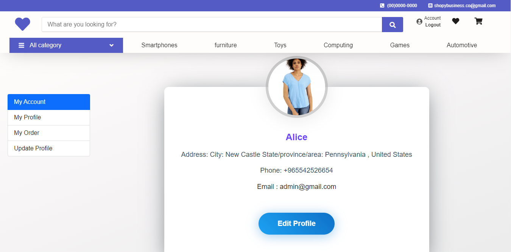
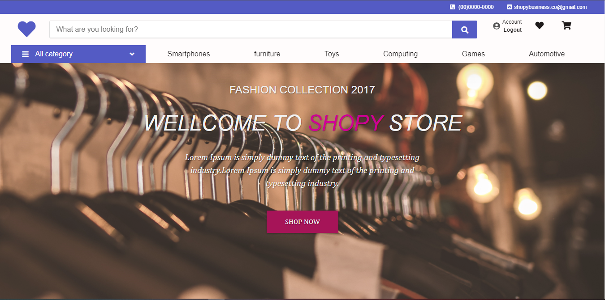
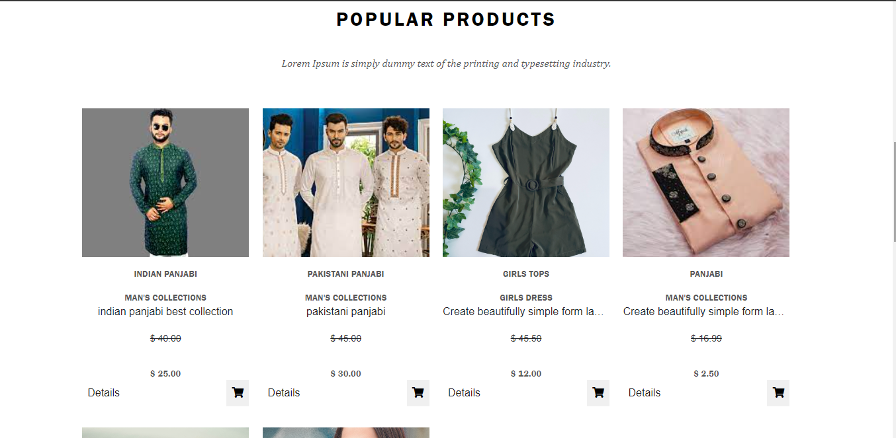

#ShopYebusiness
****
### **_`It is a E-commerce web applocation and api made in django and django rest framework or stripe payment system.`_**

#feature:
 And ongoing project development with product search, product shows by category, add to carts, checkouts, etc.
Account Creation, Updated Account Information

####Profile: 

####Home: 

#### Product Section: 

#### More Feature Summer Collections :

###### You can clone this project if you want and follow the steps below to run.
    https://github.com/iamfoysal/shopyebusiness.git

#### Installing virtualenv

    py -m pip install --user virtualenv 

#### Creating a virtual environmen
     py -m venv env 

#### Activating a virtual environment
    .\env\Scripts\activate 
 
####  install requirements.txt
    pip install -r requirements.txt 

####  Run server
    py manage.py runserver 

#### localhost: 
    http://127.0.0.1:8000/
****

